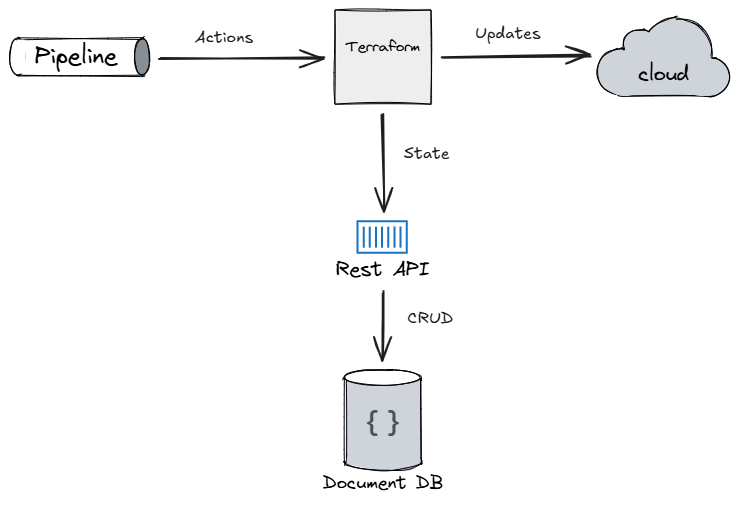

# Architecture

**Terraform Backend MongoDB** makes the link between Terraform and MongoDB, two industry standards.
It's an integration, not a new application.

## High-level view

Terraform (or OpenTofu) is configured with the [HTTP backend](https://developer.hashicorp.com/terraform/language/backend/http) and talks to the REST API over `/{tenant}/state/{name}` endpoints to read, write, lock and unlock state.
The API persists everything in MongoDB.

## Code structure

The solution follows a lightweight clean architecture with three projects and one-way dependencies (`WebApi` → `Infrastructure.MongoDb` → `Domain`):

Project                  | Role
-------------------------|--------------------------------------------------------------
`Domain`                 | Models and repository interfaces, with no infrastructure reference
`Infrastructure.MongoDb` | Repository implementations using the MongoDB .NET driver
`WebApi`                 | ASP.NET Core host: controller, authentication, configuration

Key components:

- **`StateController`** implements the Terraform HTTP backend protocol: state read/write/delete plus lock/unlock endpoints.
  It returns HTTP `423 Locked` when a state is locked and `409 Conflict` (with the current lock as body) when the lock is held by another run.
- **`BasicAuthenticationHandler`** validates HTTP Basic credentials against the `user` collection (passwords hashed with BCrypt) and attaches a tenant claim.
- **`TenantAuthorizationFilter`** ensures the authenticated user can only access the `{tenant}` segment of the route, providing per-tenant isolation.

## Data model

Collection           | Content
---------------------|--------------------------------------------------------------
`tf_state`           | Latest state document per tenant/name (raw Terraform state JSON)
`tf_state_history`   | JSON-diff patch recorded on every state change, with timestamp
`tf_state_lock`      | Active Terraform locks (unique index on tenant + name)
`user`               | API users: username, BCrypt password hash, tenant
`auth_lockout`       | Failed authentication attempts per username and source address, expiring

The required indexes are listed in the [setup guide](setup.md#database-indexes).
